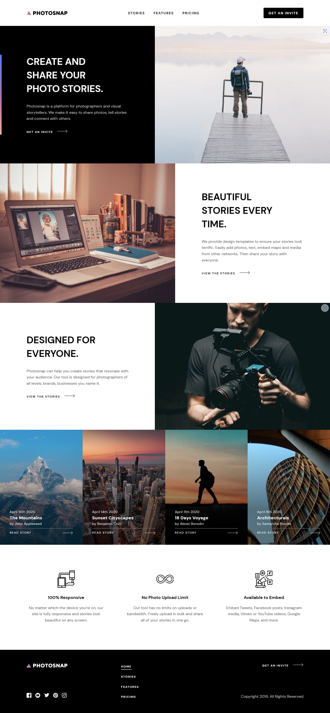

# Frontend Mentor - Photosnap Website

## Table of contents

- [Frontend Mentor - Photosnap Website](#frontend-mentor---photosnap-website)
  - [Table of contents](#table-of-contents)
    - [Links](#links)
  - [Screenshot](#screenshot)
    - [Home](#home)
    - [Stories](#stories)
    - [Features](#features)
    - [Pricing](#pricing)
  - [The challenge](#the-challenge)
    - [Expected Behaviour](#expected-behaviour)
      - [Multiple Pages](#multiple-pages)
      - [Stories](#stories-1)
      - [Call-to-action links](#call-to-action-links)
    - [Built with](#built-with)
  - [Author](#author)

### Links

- Solution URL: [Front mentor profile](https://www.frontendmentor.io/profile/Matondo99)
- Live Site URL: [photosnap-multi-page](https://bawi99.github.io/photosnap-multi-page/stories.html)

## Screenshot

### Home

| Desktop | Tablet | Mobile | Mobile menu |
|:---------:|:--------:|:--------:|:--------:|
| |  |  |  |

### Stories

| Desktop | Effects | Tablet | Mobile |
|:---------:|:--------:|:--------:|:--------:|
|  |  |  |  |

### Features

| Desktop | Tablet | Mobile |
|:---------:|:--------:|:--------:|
|  |  |  |

### Pricing

| Desktop | Tablet | Mobile |
|:---------:|:--------:|:--------:|
|  |  |  |

## The challenge

Your challenge is to build out this multi-page website and get it looking as close to the design as possible.

You can use any tools you like to help you complete the challenge. So if you've got something you'd like to practice, feel free to give it a go.

Your users should be able to:

- View the optimal layout for each page depending on their device's screen size
- See hover states for all interactive elements throughout the site

Want some support on the challenge? [Join our Slack community](https://www.frontendmentor.io/slack) and ask questions in the **#help** channel.

### Expected Behaviour

The following points are to clarify behaviour for areas where you might not be sure what's expected.

#### Multiple Pages

- The "Get an invite" call-to-action throughout the site should be an anchor tag, but doesn't link anywhere. If this was a real website, this could link to a sign up or application form.

#### Stories

- If this were a real site, each item on this page would be clickable and could link off to each of these stories in their own sites. So each item should be wrapped with an anchor tag, but it won't link anywhere on this project.

#### Call-to-action links

li#links The "Pick a plan" call-to-actions in the pricing tiers should be anchor tags, but they don't link anywhere. If this was a real website, this could link to a checkout form.

### Built with

- Semantic HTML5 markup
- CSS custom properties
- Flexbox
- CSS Grid
- Mobile-first workflow
- Vanilla JavaScript image Slider

## Author

- Website - [Astar Bahouidi](https://github.com/Bawi99)
